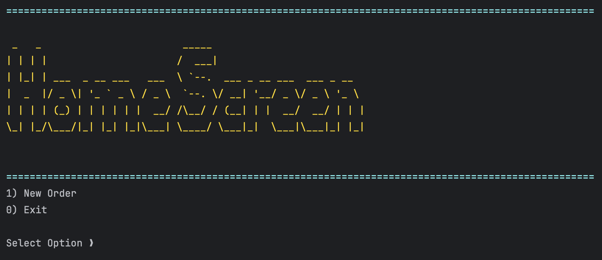
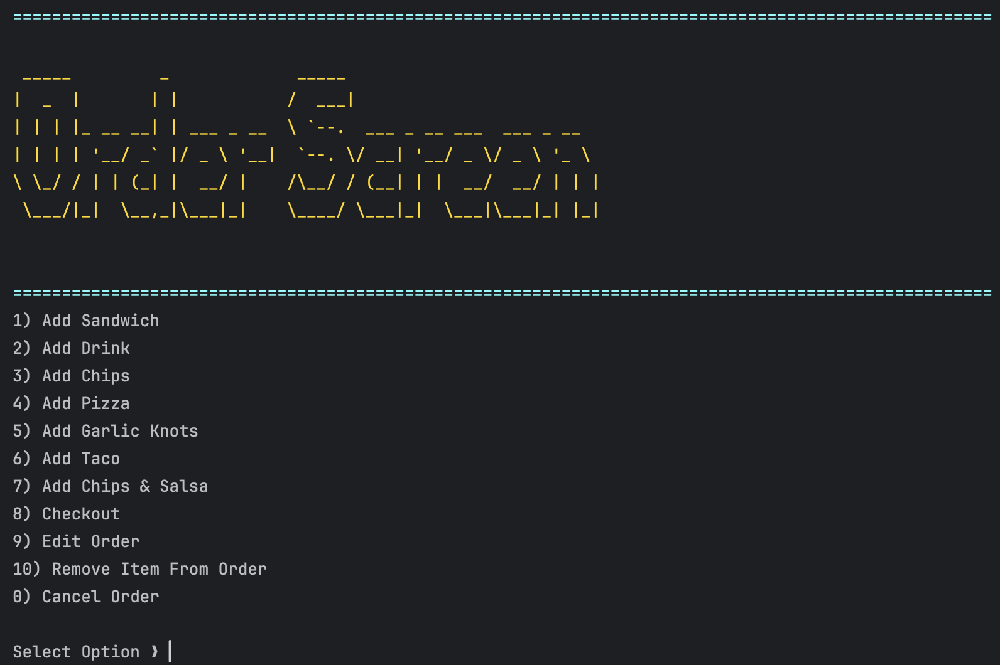
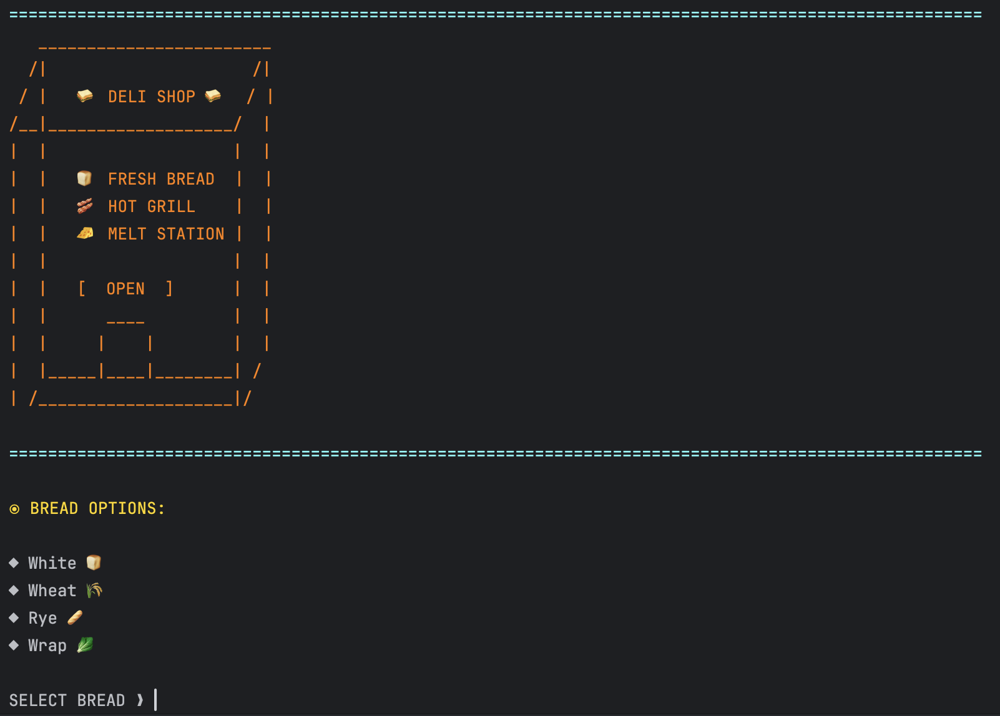
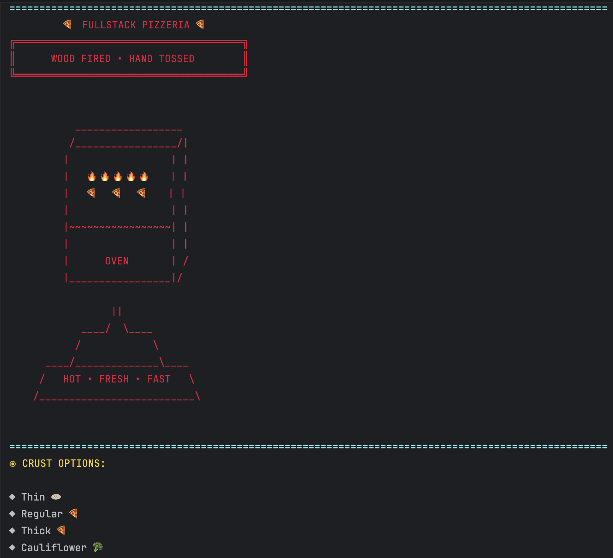
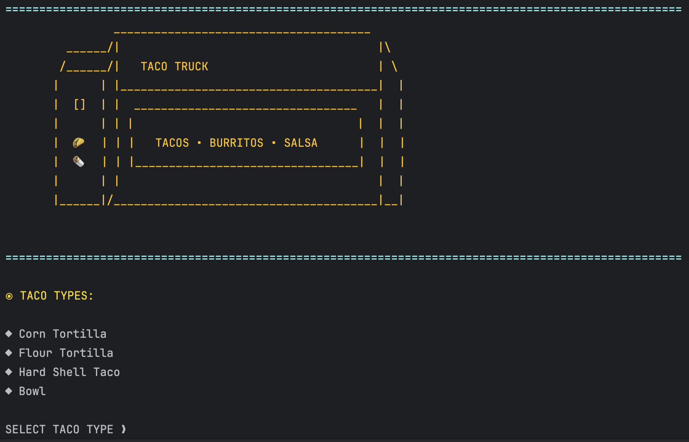
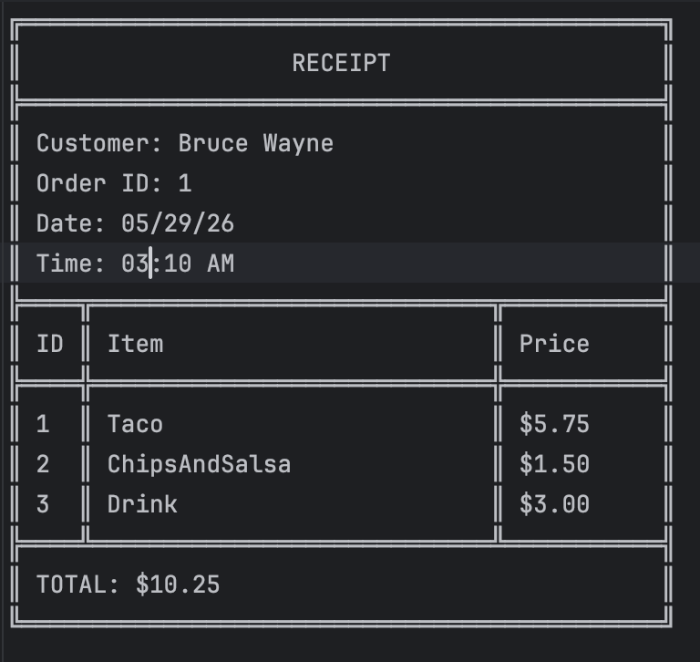

# <h1 align="center"> FullStack Eats </h1>

<p align="center">
FullStack Eats is a terminal-based restaurant ordering application built entirely in Java. The application combines three different food experiences into a single ordering system:
</p>

* 🥪 FullStack Deli
* 🍕 FullStack Pizzeria
* 🌮 Taco Truck

Customers can create and customize food items, add them to an order, edit items after creation, remove items, view order details, and generate a receipt when the order is confirmed.

This project was designed to demonstrate both fundamental and advanced object-oriented programming concepts while creating a realistic, menu-driven application.

---

## ⚙️ Features

### Ordering System

* Create new customer orders
* Add multiple food items to a single order
* Edit existing items before checkout
* Remove items from an order
* Calculate order totals automatically
* Confirm or cancel orders

### FullStack Deli 

Customers can customize sandwiches by selecting:

* Bread type
* Sandwich size
* Toasted or non-toasted
* Premium meats
* Premium cheeses
* Regular toppings
* Sauces
* Sides

Additional premium toppings can also be marked as "extra" for an additional charge.

### FullStack Pizzeria

Customers can customize pizzas by selecting:

* Pizza size
* Crust type
* Stuffed crust option
* Premium meats
* Premium cheeses
* Vegetables
* Sauces

Pizza pricing automatically adjusts based on size and toppings selected.

### Taco Truck

Customers can order:

* Single Tacos
* Three-Taco Combos
* Burritos
* Chips and Salsa

Customization options include:

* Taco shell type
* Premium meats
* Premium cheeses
* Regular toppings
* Sauces
* Sides
* Salsa and queso options

## 🧾 Receipt Generation

When an order is confirmed:

* A receipt is automatically generated
* A timestamp-based filename is created
* The receipt is saved as a `.txt` file
* The receipt is displayed to the customer

Example filename:

20260529-091015.txt

---

## 💻 Technologies Used

* Java (Amazon Corretto 26)
* JUnit 5
* Java Collections Framework
* Java Streams API
* Java NIO (Path, Files)
* File I/O
* Exception Handling

---

# Object-Oriented Programming Concepts Demonstrated

## Encapsulation 🫣

Data is stored within classes and accessed through public methods when appropriate.

Examples include:

* Order
* Sandwich
* Pizza
* Taco

## Inheritance

Common functionality is shared through inheritance.

Examples:

* Food<T>

    * Sandwich
    * Pizza
    * Taco

## Polymorphism

Different food items can be treated uniformly while maintaining their own implementations.

Examples:

* getPrice()
* orderDetails()
* editItem()

## Abstraction

Abstract classes and interfaces are used to define behavior without exposing implementation details.

Examples:

* Food<T>
* Chargeable
* FileRepository<T>

## Interfaces 

Interfaces are used to define shared capabilities across unrelated classes.

Examples:

* Chargeable
* OrganizeToppings
* FileRepository<T>

## Generics < >

Generics are used throughout the application to reduce duplication and improve type safety.

Examples:

* Food<T>
* Topping<T>
* FileRepository<T>

## Collections

The application uses collections to manage orders and toppings.

Examples:

* ArrayList
* Lists of toppings
* Lists of order items

## Streams 

Java Streams are used extensively for:

* Filtering
* Mapping
* Searching
* Formatting
* Price calculations

---

## Testing 🧪

The project includes unit tests written with JUnit.

Test Classes:

* OrderTest
* PizzaTest
* SandwichTest
* ReceiptsFileManagerTest

These tests verify:

* Price calculations
* Order totals
* Receipt creation
* Business logic behavior

---

## Error Handling ❌

Custom exceptions are used throughout the application to provide meaningful feedback to users.

Examples include:

* Invalid menu selections
* Invalid topping selections
* Missing receipt files
* Invalid order operations

---

## File Structure 📁

Receipts are automatically saved to the Receipts directory.

Example:

```text
data/
└── Receipts/
    ├── 20260529-091015.txt
    ├── 20260529-093422.txt
    └── 20260529-101530.txt
```

Each receipt contains:

* Customer information
* Order details
* Itemized pricing
* Total cost
* Timestamp information

---

## Project Structure 
## Project Structure 📁

```text
fullstack-eats/
├── data/
│   └── Receipts/
│       ├── 20260529-091015.txt
│       ├── 20260529-093422.txt
│       └── ...
│
├── images/
│   └── (README screenshots and assets)
│
├── src/
│   ├── main/
│   │   ├── java/
│   │   │   └── com.pluralsight/
│   │   │       ├── enums/
│   │   │       ├── exceptions/
│   │   │       ├── formatters/
│   │   │       ├── interfaces/
│   │   │       ├── io/
│   │   │       ├── models/
│   │   │       ├── services/
│   │   │       ├── ui/
│   │   │       └── Main.java
│   │   │
│   │   └── resources/
│   │
│   └── test/
│       └── java/
│           └── com.pluralsight/
│               ├── io/
│               └── models/
│
├── pom.xml
└── README.md
```

---

## User Interface

One of the primary goals of this project was creating an engaging terminal experience.

Features include:

* Custom ASCII art
* Colorized console output
* Dynamic menus
* Formatted tables
* Styled receipts
* Restaurant-specific themes for each ordering experience

---

## Challenges and Lessons Learned

Throughout development, I gained hands-on experience with:

* Working with Generics
* Using streams for data processing
* Implementing file persistence with Java NIO
* Writing maintainable unit tests
* Building reusable dynamic formatting utilities
* Creating a polished command-line user experience

This project significantly strengthened my understanding of both core Java and modern Java development practices.

---

## Future Improvements 🔮

Potential future enhancements include:

* Database integration with JDBC or Spring Data JPA
* Customer accounts and order history
* GUI version using JavaFX
* Online ordering API
* Delivery and pickup scheduling
* Expanded menu options
* Receipt exporting to PDF

---

## Screenshots

### Main Menu



### Order Screen



### FullStack Deli



### FullStack Pizzeria



### Taco Truck



### Receipt Generation



---

## Author
Created by [Nathan Wondim](https://github.com/nathanwondim16-lab/ledger-flow) - [nathanwondim16@gmail.com](nathanwondim16:email@gmail.com)

---

## License
This project is licensed under the MIT License - see the [LICENSE.md](LICENSE.md) file for details.

--- 

Year Up United Software Development Student

FullStack Eats was created as a capstone-style Java application to demonstrate object-oriented design, testing, file handling, and modern Java development practices.
